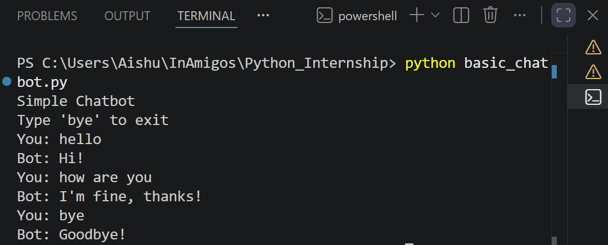

# Basic Chatbot

## Description
A simple rule-based chatbot developed in Python as part of a Python Programming Internship task.

## Features
- Responds to basic greetings
- Answers "How are you?"
- Exits when the user types "bye"
- Uses loops, functions, and conditional statements

## Technologies Used
- Python 3

## How to Run

```bash
python basic_chatbot.py
```

## Sample Inputs

hello

how are you
## Output Screenshot



bye

## Author

Rashmitha
